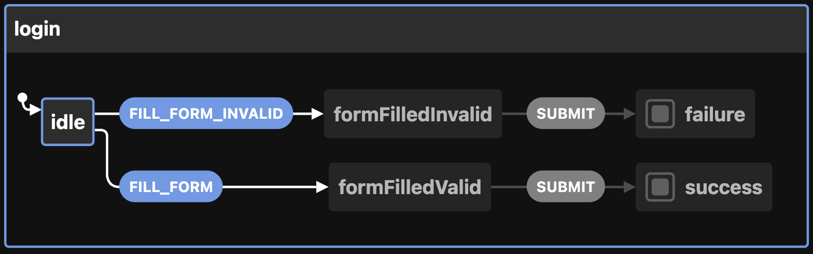

# Model-Based Testing Demo With Playwright for Login Flow

## Summary

This project demonstrates model-based testing using XState for state machines and Playwright for browser automation. The login form functionality is tested with various scenarios like valid and invalid form submissions.

## Overview

1. HTML (`index.html`): A simple login form with an email, password input, and a submit button. When the form is submitted, it checks if the credentials match the predefined valid ones and displays a corresponding message ('Welcome!' or 'Invalid credentials.').

2. XState State Machine (`loginMachine.ts`): Defines the state machine for the login form. It includes states for idle, formFilledValid, formFilledInvalid, success, and failure. Each state transition is triggered by specific events like FILL_FORM, FILL_FORM_INVALID, and SUBMIT.



3. Playwright Tests (`login.spec.ts`): A set of model-based tests that simulate user interactions using Playwright to test different paths in the login process. It verifies that the form behaves correctly based on the user's input and ensures that all possible paths are covered.

## Project Setup

### Clone the repository:
```
git clone git@github.com:nora-weisser/model_based_testing_with_playwright.git
cd model_based_testing_with_playwright
```

### Install dependencies:
```
npm install
```

### Starting the local server:
Make sure your application is running locally at http://localhost:3000. You can serve the index.html file using any static file server.

Example (using http-server):
```
npx http-server -p 3000
```
This will start the server at http://localhost:3000, where the tests will be executed.

### Run the tests:

```
npx playwright test
```
